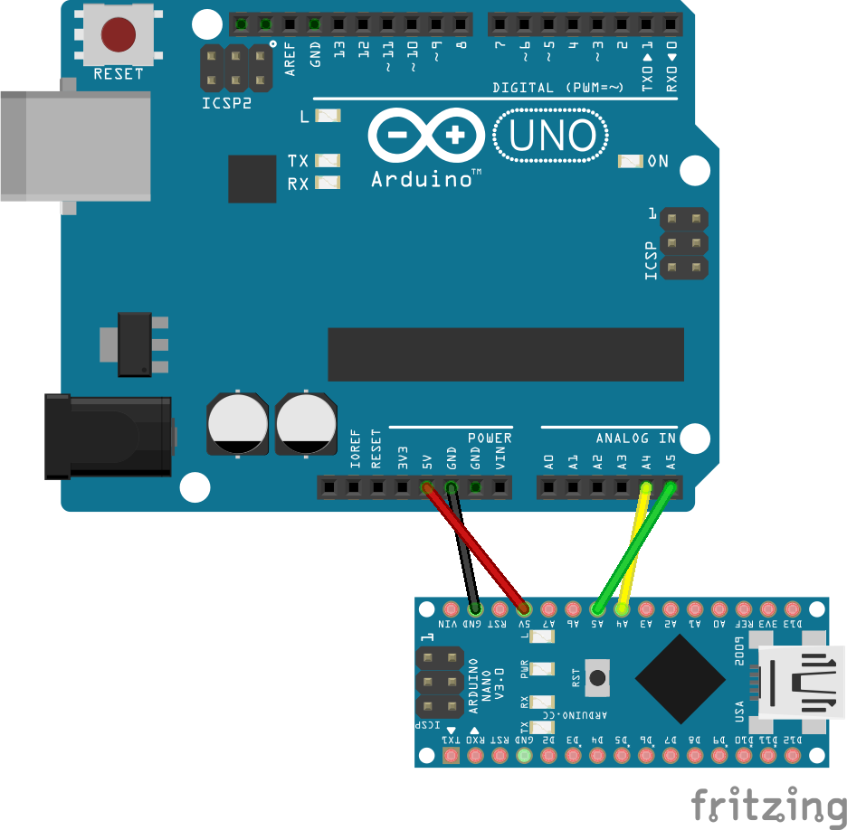

# interchange-arduino


This repository contains the latest source files for the interchange library
for arduino usage.

See http://github.com/ajfisher/nodebots-interchange for more information about
Interchange.

This library provides a drop in interface for nodebots I2C backpacks including
EEPROM manipulation and the interchange configuration client to connect to.

A production example of this library in action is available at
https://github.com/ajfisher/nodebots-hcsr04

A demo example is also provided in the `examples` directory that includes helper
grunt configuration to show how the build process can work for your application.

## Installation.

The best way to use this library it to use it as a submodule in your own repo
and then include it into your build process using Grunt (or make or other process).

This means your version of interchange can be kept up to date and as it's simply
source files and you can get the benefit of any improvements.

Typically this might look like this (assuming `great-backpack` is a git repo already).

```
cd great-backpack
```

A backpack repo should have a `firmware` folder that contains three folders:

* `bin`: the binary hex files produced by your compilation process that will be
put on the arduino targets. This should be automated.
* `build`: the built files with any modifications, composition etc that is needed
to compile the binaries. Again this should be automated.
* `src`: your source files that will be used to build your backpack library.

Within `src` you would usually have two sub folders, `controller` which contains
the code for your controller that you're going to build and then `libs` which
contain any third party libraries such as Interchange (or firmata or node-pixel etc).

We'll assume you have this structure so your submodule is put in the right place.

```
git submodule add https://github.com/ajfisher/interchange-arduino.git firmware/src/libs/interchange-arduino
```

This will now add a folder called `interchange-arduino` to your `src/libs`
folder which you can now use as a source in your build process.

## Usage

You will need to include the `interchange-arduino/src` files into your project
and bring them in as part of your build steps. In this case we'll use grunt
to demonstrate this process.

### Make a build pipeline

Assuming you have a file called `backpack.ino` at `src/controller` the first thing
to do is make a build pipeline that copies your files from the controller and
libs directories to a build directory to compile from.

In grunt include a task such as that given below:

```
    grunt.initConfig({
        // exec: create task dynamically see end of file for where this happens.
        copy: {
            options: {
                timestamp: true,
            },

            backpack: {
                cwd: 'firmware/src/',
                flatten: true,
                src: [ 'controller/*', 'libs/interchange-arduino/*'  ],
                dest: 'firmware/build/backpack/',
                expand: true,
                filter: 'isFile',
            },
        },
    });

    grunt.loadNpmTasks('grunt-contrib-copy');
```

You can now run:

```
grunt copy
```

And your files will be copied from the appropriate sources to a single destination.
Generally you should set a `clean` task as well that cleans out that destination
folder so you ensure you aren't getting any dodgy old files and it's rebuilt
properly each time.

From there you should now be able to compile your `.ino` file from the Arduino
IDE and it should compile properly.

A fully working example, including the automated compilation step is available
in the [example Gruntfile](/examples/Gruntfile.js).

### Using Interchange in your backpack sketch

To make the Interchange library available you should include it into your
`src/controller/backpack.ino` file. Somewhere near the top of the file add the
following:

```c
#include "interchange.h"
```

This will bring the library in with all of it's capabilties.

To use the library add something like the following `setup()` function to your
backpack sketch.

```
void setup() {

    // check to see if we're in config mode
    config_check();

    if (state == CONFIG) {
        Serial.begin(9600);
        run_config(Serial, FIRMWARE_VERSION);

    } else if (state == RUNNING) {
        uint8_t i2c_address;

        if (use_custom_address() ) {
            if (get_i2c_address() > 0) {
                i2c_address = get_i2c_address();
            } else {
                i2c_address = DEFAULT_I2C_SENSOR_ADDRESS;
            }
        } else {
            i2c_address = DEFAULT_I2C_SENSOR_ADDRESS;
        }

        Wire.begin(i2c_address);
        Wire.onRequest(requestData);
    }
}
```

Breaking this down, Interchange provides a state machine that determines if it
is in config or running mode. Config mode is usually entered by pulling PIN 2
HIGH during the boot stage. You can modify this by setting:

```
#define CONFIG_PIN 2
```

_AFTER_ the `interchange.h` include has been made (this will redefine the setting).

You should also provide a `FIRMWARE_VERSION` as a #define to provide the version
of your firmware so it can be provided to the user properly.

If you aren't in CONFIG state you'll be in RUNNING state and you can see there's
some logic which determines if you should be using a custom address (this can
be set by the user if they want to override the default) and then it drops through
to picking up the user defined one or a given `DEFAULT_I2C_SENSOR_ADDRESS` which
should also be `#define`d in your code.

Once the I2C address is determined it will start the I2C wire library and you can
set the `onRequest()` and `onResponse()` handler appropriately.

## Example application

The example application is available in [the examples folder](/examples). It is
designed to simply output the value of the current running time of the arduino
in seconds since boot each time it's requested.

Files in use:

* `Gruntfile.js` provides the copy and build tasks to build the sketch
* `firmware/*` provides the src, build and bin folders according to the notes given
above. Noting that the `libs` component of this is being picked up from the root
`src` folder of this project.
* `firmware/src/testBackpack.ino` contains the sketch.
* `package.json` is used to install the various dependencies for node.
* `example.js` is a nodeJS script designed to talk to the backpack.
* `manifest.json` is an Interchange manifest file with the backpack details in it.

To use:

```sh
cd examples
npm install
grunt compile
# TODO update this next bit for local install.
interchange install git+https://github.com/ajfisher/interchange-arduino -a <board> -p <port>
```

Where `<board>` is the board type you want to use being `uno|nano|pro-mini` and
`<port>` is the path to the serial port, eg: `/dev/tty.usbmodem1411`.

Wire up as shown in the diagram below:



Make sure you have an arduino with standardFirmata on it or else another
Johnny-Five capable board and you will be able to talk to the test backpack using
the instruction below:

```
node example.js
```

If everything is running correctly you should see the byte data coming from I2C
and the recomposition of that to the actual duration. It will look something like:

```
1448416862373 Connected /dev/tty.wchusbserial1410
1448416865963 Repl Initialized
>> Connected to board. Will now periodically read I2C data
[ 0, 0, 7, 186 ]
Duration: 1978
[ 0, 0, 7, 187 ]
Duration: 1979
[ 0, 0, 7, 188 ]
Duration: 1980
[ 0, 0, 7, 189 ]
Duration: 1981
[ 0, 0, 7, 190 ]
Duration: 1982
[ 0, 0, 7, 191 ]
Duration: 1983
[ 0, 0, 7, 192 ]
Duration: 1984
```

You can also connect the nano or backpack to your computer and run a serial
monitor. If you do, you'll see debug information coming out relating to the
data that is about to be passed over I2C. This looks like:

```
Test Backpack firmware - DEBUG MODE
Use custom: 0
I2C address: 39
DUR: 0 rm: 0 0 0 0
DUR: 1 rm: 0 0 0 1
DUR: 2 rm: 0 0 0 2
DUR: 3 rm: 0 0 0 3
DUR: 4 rm: 0 0 0 4
DUR: 5 rm: 0 0 0 5
```
